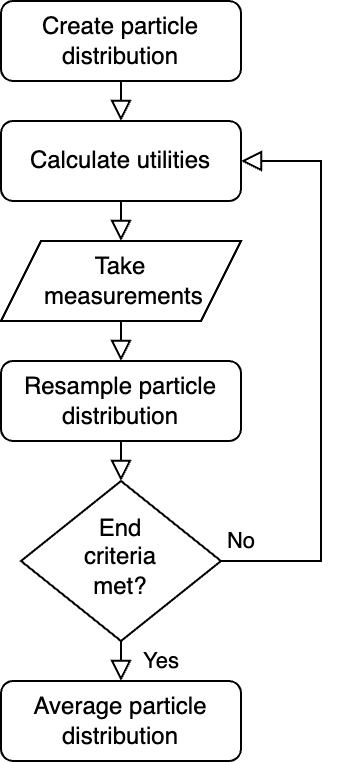

# Summary

SEABED: SEquential Analysis and Bayesian Experimental Design is a Python 3 package designed to optimize the collection and interpretation of noisy experimental data. It leverages Bayesian inference to approximate the true parameters of a given model with limited information, allowing users to arrive at an answer while dramatically reducing the required amount of data. Importantly, SEABED’s particle filtering approach enables efficient parallelization of calculations via the JAX package, a library for JIT compilation of array-based computation. Sequential updates to the particle probability distribution also allow this package to adaptively select input settings with the highest utility, thereby gaining maximal information with each measurement and further improving experimental efficiency. 

SEABED’s broad functionality makes it widely applicable to a variety of Python-based projects. The JAX ecosystem allows users to easily implement this package in projects involving deep learning or solving differential equations, and the flexibility of the utility metric lets users tailor this package to their individual needs. Since its release in 2023, SEABED has already found success in accelerating the characterization of solid-state defects [@autodisc_paper] and shows promise for the future.

# Statement of need

Within the field of statistical analysis, Bayesian inference is a vital tool to approximate a quantity when direct calculation may be infeasible. After defining a parametric probability distribution for measurements of a system, a Bayesian model can determine the likelihoods of different parameter values via repeated samplings. Existing Python packages for inference typically use one of three sampling methods: Markov chain Monte Carlo (MCMC) [@mcmc_book], Hamiltonian Monte Carlo (HMC) [@hmc_paper], and particle filtering [@particle_paper]. Many of these packages also define probabilistic programming languages (PPL) such as PyMC [@pymc_paper], Pyro [@pyro_paper], TensorFlow Probability [@tensorflow_paper] and Turing.jl [@turing_paper]. PPLs are a high-level interface which allow for users to easily access probabilistic models. 

SEABED is not a PPL, and instead provides a streamlined, lower-level approach to particle-filtering inference of arbitrary computational models. This allows increased flexibility and greater focus on the numerical building blocks. Similar to our package is Blackjax [@blackjax_paper], a library of samplers for JAX. However, Blackjax primarily focuses on MCMC and HMC inference in contrast to SEABED’s particle filtering. 

The feasibility of experiments which rely on inference is often dependent on how much information they gain per measurement and how quickly that information can be processed. When a procedure for Bayesian inference requires too many measurements or the likelihood calculations take a substantial amount of time, value approximation can become a bottleneck and systems with greater time dependency can no longer be accurately measured. Many inference packages do not address the usefulness of measurements, and so their efficiency is limited by the fraction of data points which provide meaningful information. Optimal Bayesian Experimental Design (OptBayesExpt) [@optbayesexpt_paper] is a specialized particle-filtering inference package which enables ”experimental design,” allowing it to propose measurements with optimal utility. 

SEABED is built off of OptBayesExpt, generalizing and streamlining its structure while including JAX to enable the utilization of GPUs and TPUs in calculation. SEABED also includes functions which update the particle distribution based on a collection of measurements as opposed to a single data point. This prevents the Bayesian model from incorrectly filtering out particles based on a single noisy measurement, a problem which other particle-filtering packages like OptBayesExpt encounter. 

SEABED aims to provide a much more generalized approach to Bayesian inference than currently exists for particle filtering. Combining JAX and experimental design allows it to increase efficiency on two separate fronts and widen the potential applications of inference.

# Functionality

\autoref{fig:flowchart} visualizes the typical SEABED inference process. Following the definition of a likelihood function and creation of the particle prior, the package can begin to select optimal measurements and update its particle distribution accordingly. Each Bayesian update can be completed by considering either a single data point or multiple, with multiple points increasing the accuracy of particle filtering. Scripts which utilize SEABED can also cycle between Bayesian updates and measurement selection to sequentially improve the model's utility calculations and choose the most efficient measurements.

The utility calculation included in the SEABED package is one based on Shannon entropy. This is a method of calculating the information for a random variable with a given probability distribution [@shannon_paper]. For an input $s$, output $y$, and particle distribution $A$, the particle's Shannon entropy is calculated as

\begin{equation}
    H(s, y, A) = -\sum_{\vec{\alpha}\in A}P(y|s, \vec{\alpha})\log[P(y|s, \vec{\alpha})],
\end{equation}
where $P(y|s, \vec{\alpha})$ is the probability of observing $y$ given input $s$ and particle $\vec{\alpha}$. 

For a given output, the utility function computes the expected change in Shannon entropy after resampling particles. Because high utility measurements will lead to a resampling with low posterior entropy, the utility is returned as -1 times the entropy change. The utility for each input is then determined by considering the utility function at each possible output. 

The entropy-based utility calculation is widely applicable, and thus included as the default utility metric for SEABED. The package also easily accepts a user-defined utility function for contexts which require a more unique approach. 

# Acknowledgements
SEABED originated as a fork of OptBayesExpt and has since undergone significant deviations from the original software and structure. This work (P.K., D.P.M., N.D., J.Z. and F.J.H.) is primarily supported by LDRD funding from Argonne National Laboratory, as part of the Autonomous Discovery Initiative. We acknowledge additional support in part by the U.S. Department of Energy, Office of Science, Office of Workforce Development for Teachers and Scientists (WDTS) under the Science Undergraduate Laboratory Internships Program (N.M.), the Open Quantum Initiative (A.B.), and the Q-NEXT Quantum Center supported by the U.S. Department of Energy, Office of Science, National Quantum Information Science Research Centers (J.C.M.).

# References